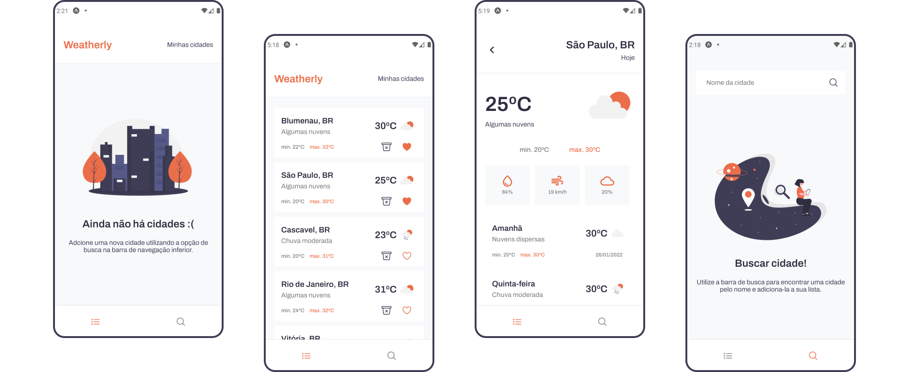

<h1 align="center">
  
</h1>
 
 

  

 

## Sobre o projeto 💬
O **Weatherly** é uma simples aplicação mobile onde é possível pesquisar por cidades, adiciona-las a sua lista de previsões do tempo e por fim visualizar a previsão do tempo (atual e da semana) de cada uma das cidades que estão em sua lista. Os dados são persistidos no dispositivo do usuário, fazendo com que a sua lista de previsões não se perca ao fechar o app.

## Funcionalidades 🧠
A aplicação contém as seguintes funcionalidades
- Buscar e adicionar cidades a sua lista de previsões do tempo
- Visualizar as previsões do tempo das cidades da sua lista
- Excluir cidades da sua lista
- Favoritar cidades da sua lista

## Como utilizar? 📌
Para utilizar a aplicação em sua máquina é necessário ter os seguintes softwares instalados:
- [Node.js](https://nodejs.org/pt-br/)
- [Expo CLI](https://docs.expo.dev/workflow/expo-cli/)
- [Expo Go - iOS/Android](https://expo.dev/client)
- [Yarn](https://yarnpkg.com/) (opcional)
- [Android Studio](https://yarnpkg.com/) (opcional)
- [Xcode](https://yarnpkg.com/) (opcional)

Com os software citados acima instalados, basta seguir os seguintes passos para executar a aplicação em sua máquina:
1. **Criar uma API Key no OpenWeather**  
Visite [esse site](https://openweathermap.org/), crie uma conta e verifique seu email para gerar uma API Key.

      Obs: Após a confirmação do email pode demorar um pouco para que a API Key gerada seja validada.

2. **Clonar o projeto**  
Abra o terminal em um diretório de sua preferência e cole o seguinte código: *`git clone https://github.com/vinixiii/Weatherly`*

3. **Criar variável de ambiente**  
No diretório raiz do projeto crie um arquivo *`.env`* e coloque sua API Key conforme o exemplo que há no arquivo *`.env.example`*

4. **Intalar as dependências**  
Dentro do diretório do projeto instale as dependências pelo terminal com *`npm install`* ou *`yarn`*

3. **Executar o app**  
Dentro do diretório do projeto abra o terminal e digite o comando *`expo start`*, em seguida escaneie o código QR com o `Expo Go` para ver no seu dispositivo, ou escolha uma das opções exibidas para abrir em um emulador iOS/Android.

## Tecnologias e ferramentas 🛠
Desenvolvido utilizando as seguintes tecnologias e ferramentas:
- [Expo](https://docs.expo.dev/)
- [React Native](https://reactnative.dev/)
- [React Navigation](https://reactnavigation.org/)
- [Typescript](https://www.typescriptlang.org/)
- [Styled Components](https://styled-components.com/)

---

Feito com ❤ por: Vinícius Figueiroa 🙋🏻‍♂️

